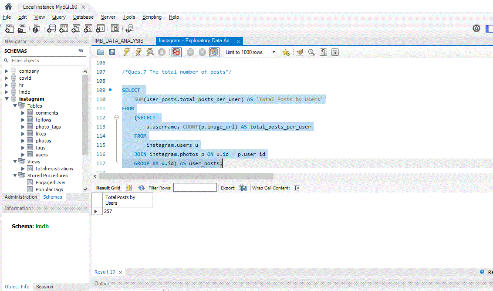
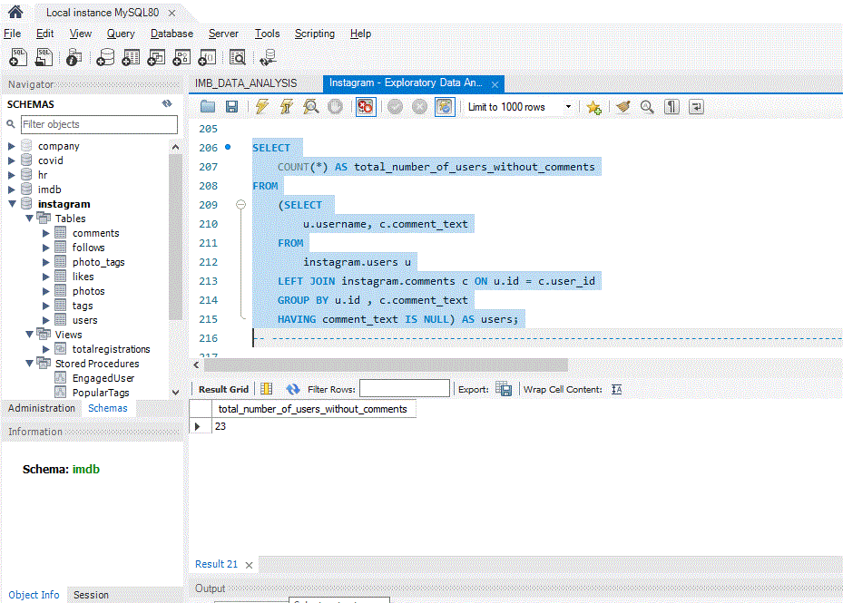

# Project Overview

*This MySQL project is a cloned mimic version of Instagram's database. It is used to perform data analysis for real world business related questions and scenarios. MySQL is the language used to create the database and analyse it. And Tableau is used to visualize the dataset.*

----------------------------------------------------------------------------------------------------------------
## Data and Exploration

### - Dataset 

The database **`instagram`** is created using SQL. <br />
There are 7 tables: *Users, Photos, Likes, Comments, Follows, Tags, Photo Tags*.

###  Exploration Questions 
### Queries Performed On The Dataset <br />
 
**The following questions are explored in this case study:**
 
- **Ques.1 The first 10 users on the platform**

**QUERY**
```
SELECT 
    *
FROM
    instagram.users
ORDER BY created_at ASC
LIMIT 10;
````
```
+----+------------------+---------------------+
| id | username         | created_at          |
+----+------------------+---------------------+
| 80 | Darby_Herzog     | 2016-05-06 00:14:21 |
| 67 | Emilio_Bernier52 | 2016-05-06 13:04:30 |
| 63 | Elenor88         | 2016-05-08 01:30:41 |
| 95 | Nicole71         | 2016-05-09 17:30:22 |
| 38 | Jordyn.Jacobson2 | 2016-05-14 07:56:26 |
| 71 | Nia_Haag         | 2016-05-14 15:38:50 |
| 40 | Rafael.Hickle2   | 2016-05-19 09:51:26 |
| 58 | Aurelie71        | 2016-05-31 06:20:57 |
| 88 | Clint27          | 2016-06-02 21:40:10 |
| 91 | Bethany20        | 2016-06-03 23:31:53 |
+----+------------------+---------------------+
10 rows in set (0.00 sec)
```
**OUTPUT**


- ***Ques.2 Total number of registrations.***

```
SELECT 
    COUNT(*) AS 'Total Registration'
FROM
    instagram.users;
```

***OUTPUT***


- **Ques.3 The day of the week most users register on** 

```
CREATE VIEW totalregistrations AS
    SELECT 
        DATE_FORMAT(created_at, '%W') AS 'day of the week',
        COUNT(*) AS 'total number of registration'
    FROM
        instagram.users
    GROUP BY 1
    ORDER BY 2 DESC;
    
SELECT  *
FROM totalregistrations;

/*Version 2*/

SELECT 
    DAYNAME(created_at) AS 'Day of the Week',
    COUNT(*) AS 'Total Registration'
FROM
    instagram.users
GROUP BY 1
ORDER BY 2 DESC;
```
***OUTPUT***


- **Ques.4 The users who have never posted a photo**

```
SELECT 
     u.username, p.image_url, COUNT(*) AS total
FROM
    instagram.photos p
        INNER JOIN
    instagram.likes l ON l.photo_id = p.id
        INNER JOIN
    instagram.users u ON p.user_id = u.id
GROUP BY p.id
ORDER BY total DESC
LIMIT 1;
```

***OUTPUT***


- **Ques.5 The most likes on a single photo**
```
SELECT 
    ROUND((SELECT 
                    COUNT(*)
                FROM
                    instagram.photos) / (SELECT 
                    COUNT(*)
                FROM
                    instagram.users),
            2) AS 'Average Posts by Users';
```


- ***Ques.6 The number of photos posted by most active users***

```
SELECT 
	u.username AS 'Username',
    COUNT(p.image_url) AS 'Number of Posts'
FROM
    instagram.users u
        JOIN
    instagram.photos p ON u.id = p.user_id
GROUP BY u.id
ORDER BY 2 DESC
LIMIT 5;
```


- ***Ques.7 The total number of posts***
```
SELECT 
    SUM(user_posts.total_posts_per_user) AS 'Total Posts by Users'
FROM
    (SELECT 
        u.username, COUNT(p.image_url) AS total_posts_per_user
    FROM
        instagram.users u
    JOIN instagram.photos p ON u.id = p.user_id
    GROUP BY u.id) AS user_posts;
```


- ***Ques.8 The total number of users with posts***
```
SELECT 
    COUNT(DISTINCT (u.id)) AS total_no_of_users_with_posts
FROM
    instagram.users u
        JOIN
    instagram.photos p ON u.id = p.user_id;
```


- ***Ques.9 The usernames with numbers as ending***
```
SELECT 
    id, username
FROM
    instagram.users
WHERE
    username REGEXP '[$0-9]';
```


- ***Ques.10 The usernames with charachter as ending***
```
SELECT 
    id, username
FROM
    instagram.users
WHERE
    username NOT REGEXP '[$0-9]';
```


- ***Ques.11 The number of usernames that start with A***
```
SELECT 
    COUNT(id)
FROM
    instagram.users
WHERE
    username REGEXP '^[A]';
```


- ****Ques.12 The most popular tag names by usage***
```
SELECT 
    t.tag_name, COUNT(tag_name) AS seen_used
FROM
    instagram.tags t
        JOIN
    instagram.photo_tags pt ON t.id = pt.tag_id
GROUP BY t.id
ORDER BY seen_used DESC
LIMIT 10;
```


- ***Ques.13 The most popular tag names by likes***
```
SELECT 
    t.tag_name AS 'Tag Name',
    COUNT(l.photo_id) AS 'Number of Likes'
FROM
    instagram.photo_tags pt
        JOIN
    instagram.likes l ON l.photo_id = pt.photo_id
        JOIN
    instagram.tags t ON pt.tag_id = t.id
GROUP BY 1
ORDER BY 2 DESC
LIMIT 10;
```


- ***Ques.14 The users who have liked every single photo on the site***

```
SELECT 
    u.id, u.username, COUNT(l.user_id) AS total_likes_by_user
FROM
    instagram.users u
        JOIN
    instagram.likes l ON u.id = l.user_id
GROUP BY u.id
HAVING total_likes_by_user = (SELECT 
        COUNT(*)
    FROM
        instagram.photos);
```
***OUTPUT***


***Ques.15 Total number of users without comments***
```
SELECT 
    COUNT(*) AS total_number_of_users_without_comments
FROM
    (SELECT 
        u.username, c.comment_text
    FROM
        instagram.users u
    LEFT JOIN instagram.comments c ON u.id = c.user_id
    GROUP BY u.id , c.comment_text
    HAVING comment_text IS NULL) AS users;
```


- ****Ques.16 The percentage of users who have either never commented on a photo or likes every photo***

```
SELECT 
    tableA.total_A AS 'Number Of Users who never commented',
    (tableA.total_A / (SELECT 
            COUNT(*)
        FROM
            instagram.users u)) * 100 AS '%',
    tableB.total_B AS 'Number of Users who likes every photos',
    (tableB.total_B / (SELECT 
            COUNT(*)
        FROM
            instagram.users u)) * 100 AS '%'
FROM
    (SELECT 
        COUNT(*) AS total_A
    FROM
        (SELECT 
        u.username, c.comment_text
    FROM
        instagram.users u
    LEFT JOIN instagram.comments c ON u.id = c.user_id
    GROUP BY u.id , c.comment_text
    HAVING comment_text IS NULL) AS total_number_of_users_without_comments) AS tableA
        JOIN
    (SELECT 
        COUNT(*) AS total_B
    FROM
        (SELECT 
        u.id, u.username, COUNT(u.id) AS total_likes_by_user
    FROM
        instagram.users u
    JOIN instagram.likes l ON u.id = l.user_id
    GROUP BY u.id , u.username
    HAVING total_likes_by_user = (SELECT 
            COUNT(*)
        FROM
            instagram.photos p)) AS total_number_users_likes_every_photos) AS tableB;
```


-------------------------------------------------------------------------------------------------------------------------------------------------
## Data Visualization 

*See the **[Interactive Dashboard]()** live on my Tableau Public profile.*  


